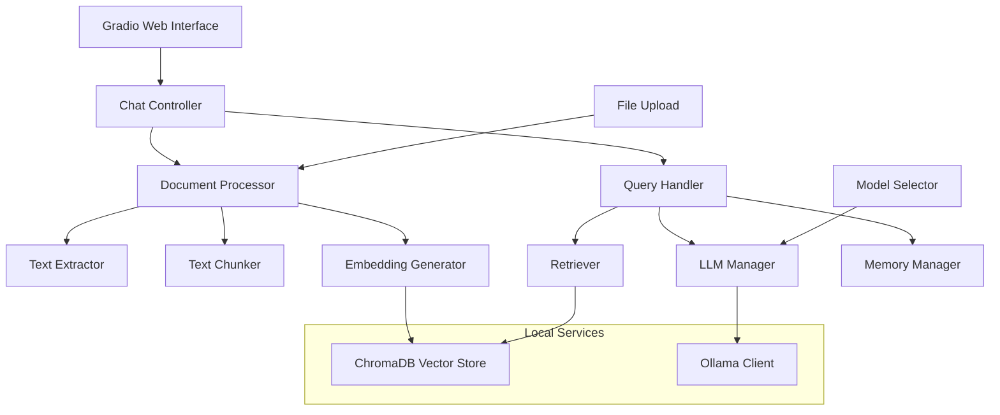

# Design Document

## Overview

The Technical Documentation RAG Bot is a local AI-powered question-answering system that combines document retrieval with language generation. The system uses a modular architecture with clear separation between document processing, vector storage, retrieval, and generation components. All processing happens locally using Ollama for LLM inference, ChromaDB for vector storage, and Gradio for the web interface.

## Architecture



The architecture follows a layered approach:
- **Presentation Layer**: Gradio web interface
- **Application Layer**: Controllers and managers
- **Processing Layer**: Document processing and query handling
- **Storage Layer**: ChromaDB vector database
- **External Services**: Ollama for LLM inference

## Components and Interfaces

### 1. Document Processor

**Purpose**: Handles document ingestion, text extraction, chunking, and embedding generation.

**Key Classes**:
- `DocumentProcessor`: Main orchestrator for document processing
- `TextExtractor`: Extracts text from various file formats (PDF, TXT, MD)
- `TextChunker`: Splits documents into semantically meaningful chunks
- `EmbeddingGenerator`: Creates vector embeddings using sentence-transformers

**Interfaces**:
```python
class DocumentProcessor:
    def process_document(self, file_path: str) -> List[DocumentChunk]
    def process_multiple_documents(self, file_paths: List[str]) -> List[DocumentChunk]
    
class TextExtractor:
    def extract_text(self, file_path: str, file_type: str) -> str
    
class TextChunker:
    def chunk_text(self, text: str, metadata: dict) -> List[TextChunk]
    
class EmbeddingGenerator:
    def generate_embeddings(self, chunks: List[TextChunk]) -> List[np.ndarray]
```

### 2. Vector Store Manager

**Purpose**: Manages ChromaDB operations for storing and retrieving document embeddings.

**Key Classes**:
- `VectorStoreManager`: Handles ChromaDB operations
- `DocumentChunk`: Data model for stored document chunks

**Interfaces**:
```python
class VectorStoreManager:
    def add_documents(self, chunks: List[DocumentChunk]) -> None
    def similarity_search(self, query: str, k: int = 5) -> List[DocumentChunk]
    def get_collection_info(self) -> dict
    
class DocumentChunk:
    content: str
    metadata: dict
    embedding: np.ndarray
    source: str
```

### 3. Query Handler

**Purpose**: Processes user queries, retrieves relevant context, and generates responses.

**Key Classes**:
- `QueryHandler`: Main query processing orchestrator
- `Retriever`: Handles similarity search and context retrieval
- `ResponseGenerator`: Generates responses using retrieved context

**Interfaces**:
```python
class QueryHandler:
    def handle_query(self, query: str, conversation_history: List[dict]) -> QueryResponse
    
class Retriever:
    def retrieve_context(self, query: str, k: int = 5) -> List[DocumentChunk]
    
class ResponseGenerator:
    def generate_response(self, query: str, context: List[DocumentChunk], history: List[dict]) -> str
```

### 4. LLM Manager

**Purpose**: Manages Ollama model interactions and model switching functionality.

**Key Classes**:
- `LLMManager`: Handles Ollama client operations
- `ModelManager`: Manages available models and switching

**Interfaces**:
```python
class LLMManager:
    def generate_response(self, prompt: str, model: str = None) -> str
    def get_available_models(self) -> List[str]
    def switch_model(self, model_name: str) -> bool
    
class ModelManager:
    def list_ollama_models(self) -> List[str]
    def validate_model(self, model_name: str) -> bool
```

### 5. Memory Manager

**Purpose**: Handles conversation history and context management.

**Key Classes**:
- `MemoryManager`: Manages conversation memory using LangChain's ConversationBufferMemory
- `ConversationHistory`: Data model for storing chat history

**Interfaces**:
```python
class MemoryManager:
    def add_exchange(self, query: str, response: str) -> None
    def get_conversation_context(self) -> str
    def clear_memory(self) -> None
    def get_memory_summary(self) -> dict
```

### 6. Gradio Interface

**Purpose**: Provides web-based user interface for document upload, querying, and model management.

**Key Components**:
- File upload interface with drag-and-drop
- Chat interface with history display
- Model selection dropdown
- Source context display panel
- Progress indicators for long operations

## Data Models

### DocumentChunk
```python
@dataclass
class DocumentChunk:
    id: str
    content: str
    metadata: Dict[str, Any]  # source, page, section, etc.
    embedding: Optional[np.ndarray] = None
    
    def to_dict(self) -> dict
    def from_dict(cls, data: dict) -> 'DocumentChunk'
```

### QueryResponse
```python
@dataclass
class QueryResponse:
    answer: str
    sources: List[DocumentChunk]
    confidence_score: float
    processing_time: float
    model_used: str
```

### ConversationExchange
```python
@dataclass
class ConversationExchange:
    timestamp: datetime
    query: str
    response: str
    sources: List[str]
    model_used: str
```

## Error Handling

### Document Processing Errors
- **File Format Errors**: Graceful handling of unsupported formats with user feedback
- **Extraction Errors**: Retry mechanisms for PDF parsing failures
- **Embedding Errors**: Fallback strategies for embedding generation failures
- **Storage Errors**: ChromaDB connection and write error handling

### Query Processing Errors
- **Retrieval Errors**: Handle empty results and vector store connection issues
- **LLM Errors**: Ollama connection failures and model loading issues
- **Memory Errors**: Conversation history overflow and corruption handling
- **Timeout Errors**: Long-running operation timeouts with user feedback

### Error Response Strategy
```python
class ErrorHandler:
    def handle_document_error(self, error: Exception, file_path: str) -> ErrorResponse
    def handle_query_error(self, error: Exception, query: str) -> ErrorResponse
    def handle_llm_error(self, error: Exception, model: str) -> ErrorResponse
```

## Testing Strategy

### Unit Testing
- **Document Processing**: Test text extraction, chunking, and embedding generation
- **Vector Operations**: Test ChromaDB storage and retrieval operations
- **LLM Integration**: Test Ollama client interactions and response generation
- **Memory Management**: Test conversation history storage and retrieval

### Integration Testing
- **End-to-End Workflows**: Test complete document upload to query response flows
- **Model Switching**: Test seamless switching between different Ollama models
- **File Format Support**: Test various document formats (PDF, TXT, MD)
- **Error Scenarios**: Test system behavior under various failure conditions

### Performance Testing
- **Response Time**: Measure query response times under different loads
- **Memory Usage**: Monitor memory consumption with large document sets
- **Concurrent Users**: Test system behavior with multiple simultaneous users
- **Large Document Handling**: Test processing of large technical documents

### User Acceptance Testing
- **Technical Query Accuracy**: Test responses to various technical questions
- **Source Citation Quality**: Verify accuracy and relevance of cited sources
- **Follow-up Context**: Test conversation memory and context preservation
- **Interface Usability**: Test Gradio interface responsiveness and user experience

## Configuration Management

### Application Configuration
```python
@dataclass
class AppConfig:
    # Vector Store Settings
    chroma_persist_directory: str = "./chroma_db"
    embedding_model: str = "all-MiniLM-L6-v2"
    
    # LLM Settings
    default_ollama_model: str = "llama3:latest"
    ollama_base_url: str = "http://localhost:11434"
    
    # Processing Settings
    chunk_size: int = 1000
    chunk_overlap: int = 200
    max_retrieval_chunks: int = 5
    
    # Memory Settings
    max_conversation_history: int = 10
    memory_buffer_size: int = 2000
    
    # Interface Settings
    gradio_port: int = 7860
    gradio_share: bool = False
```

### Environment Variables
- `OLLAMA_BASE_URL`: Ollama server URL
- `CHROMA_PERSIST_DIR`: ChromaDB storage directory
- `EMBEDDING_MODEL`: Sentence transformer model name
- `MAX_FILE_SIZE`: Maximum upload file size
- `LOG_LEVEL`: Application logging level

## Security Considerations

### File Upload Security
- File type validation and sanitization
- File size limits to prevent resource exhaustion
- Temporary file cleanup after processing
- Path traversal prevention

### Data Privacy
- Local-only processing (no external API calls)
- Secure temporary file handling
- User data isolation in multi-user scenarios
- Optional data encryption at rest

### Resource Management
- Memory usage monitoring and limits
- CPU usage throttling for large operations
- Disk space monitoring for vector storage
- Connection pooling for database operations